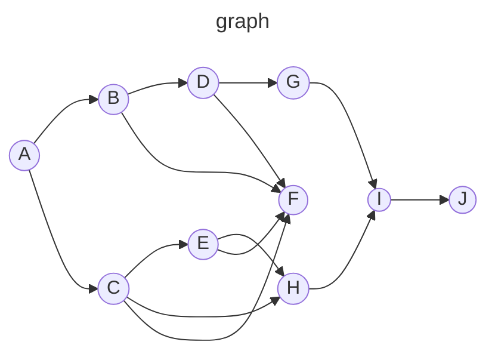

# TSignal
A topological order respecting signals library inspired by [SolidJS](https://www.solidjs.com/).
What's topological ordering you ask? Check out the readme to understand the problem with most signals libraries. <br>
Wait, this is the readme file... _uhmm_ <br>

Non-mandatory example:
```ts
// reactively compute the bounding-boxes of many nested rectangles.
// the computation should be lazy: if the bounding-box of a child-rectangle hasn't changed, then it shouldn't invoke an update in its parent-rectangle.
// if the top-most rectangle's `right` or `top` bounding-box's sides exceed `600`, then we should log `"overflow"` in the console.
// at the end of every reaction cycle, log the number of computations done in the console.

import { Context } from "jsr:@azmi/tsignal/context"
import { StateSignal_Factory, MemoSignal_Factory, EffectSignal_Factory } from "jsr:@azmi/tsignal/signal"
import type { Accessor, Setter } from "jsr:@azmi/tsignal/typedefs"

/** `x` and `y` are relative to the parent-rectangle's top-left corner (which is their (x, y) position). */
interface Rect { x: number, y: number, width: number, height: number }

/** the bounding box of a `Rect` */
interface Box { left: number, top: number, right: number, bottom: number }

const signal_ctx = new Context()
const createState = signal_ctx.addClass(StateSignal_Factory)
const createMemo = signal_ctx.addClass(MemoSignal_Factory)
const createEffect = signal_ctx.addClass(EffectSignal_Factory)
const rectEqualityFn = (rect1: Rect | undefined, rect2: Rect): boolean => {
	return rect1 === undefined ? false :
		rect1.x === rect2.x &&
		rect1.y === rect2.y &&
		rect1.width === rect2.width &&
		rect1.height === rect2.height
}
const boxEqualityFn = (box1: Box | undefined, box2: Box): boolean => {
	return box1 === undefined ? false :
		box1.top === box2.top &&
		box1.left === box2.left &&
		box1.bottom === box2.bottom &&
		box1.right === box2.right
}

type RectangleObject = Rect & { children?: RectangleObject[] }

class Rectangle {
	rect: Accessor<Rect>
	setRect: Setter<Rect>
	box: Accessor<Box>
	children: Rectangle[] = []

	constructor(initial_rect: Rect) {
		const [idRect, getRect, setRect] = createState(initial_rect, { equals: rectEqualityFn })
		const [idBox, getBox] = createMemo<Box>((id) => {
			const { x, y, width, height } = getRect(id)
			const children_boxes = this.children.map((child) => child.box(idBox))
			const
				top = Math.min(y, ...children_boxes.map((child_box) => child_box.top)),
				left = Math.min(x, ...children_boxes.map((child_box) => child_box.left)),
				bottom = Math.max(y + height, ...children_boxes.map((child_box) => y + child_box.bottom)),
				right = Math.max(x + width, ...children_boxes.map((child_box) => x + child_box.right))
			return { top, left, bottom, right }
		}, { equals: boxEqualityFn })

		this.rect = getRect
		this.setRect = setRect
		this.box = getBox
	}

	render(ctx: CanvasRenderingContext2D) {
		const { x, y, width, height } = this.rect()
		const { top, left, bottom, right } = this.box()
		const children = this.children
		ctx.fillStyle = get_next_fillcolor()
		ctx.strokeStyle = get_next_strokecolor()
		ctx.fillRect(x, y, width, height)
		ctx.strokeRect(left, top, right - left, bottom - top)
		ctx.translate(x, y)
		for (const child of children) {
			child.render(ctx)
		}
		ctx.translate(-x, -y)
	}

	static fromObject(object: RectangleObject): Rectangle {
		const { children, ...rect } = object
		const instance = new Rectangle(rect)
		const children_instances = children?.map(Rectangle.fromObject) ?? []
		instance.children.push(...children_instances)
		return instance
	}
}

let color_idx = 0
const fillcolors = ["blue", "cyan", "goldenrod", "gray", "green", "khaki", "magenta", "orange", "orchid", "red", "salmon", "seagreen", "turquoise", "violet",]
const strokecolors = fillcolors.map((color) => "dark" + color)
const get_next_fillcolor = () => { return fillcolors[color_idx++ % fillcolors.length] }
const get_next_strokecolor = () => { return strokecolors[color_idx++ % strokecolors.length] }

const all_rectangles = Rectangle.fromObject({
	x: 10, y: 20, width: 70, height: 80, children: [
		{
			x: 15, y: 25, width: 50, height: 60, children: [
				{
					x: 20, y: 30, width: 40, height: 50, children: [
						{
							x: 25, y: 35, width: 30, height: 40, children: [
								{ x: 30, y: 40, width: 20, height: 30 },
								{ x: 35, y: 45, width: 10, height: 20 }
							]
						},
						{ x: 40, y: 50, width: 10, height: 20 }
					]
				},
				{
					x: 45, y: 55, width: 10, height: 15, children: [
						{ x: 0, y: 40, width: 30, height: 50 },
						{ x: 70, y: 80, width: 50, height: 20 }
					]
				}
			]
		},
		{ x: 50, y: 60, width: 40, height: 30 }
	]
})

const canvas = document.createElement("canvas")
const ctx = canvas.getContext("2d")!
document.body.appendChild(canvas)

const [idRedraw, awaitRedraw, fireRedraw] = createEffect((id) => {
	// add dependence on all rectangles
	const add_dependence = (rect_object: Rectangle) => {
		rect_object.rect(id)
		rect_object.box(id)
		rect_object.children.forEach(add_dependence)
	}
	add_dependence(all_rectangles)

	color_idx = 0
	ctx.reset()
	ctx.scale(2, 2)
	all_rectangles.render(ctx)
})

fireRedraw()

// try the following lines in your console (one by one) to witness reactivity:
// all_rectangles.children[0].children[0].children[0].setRect({x:10, y:10, width: 20, height: 50})
// all_rectangles.children[0].children[1].setRect({x:50, y:50, width: 100, height: 50})
```

## Signal Classes

here is a list of all signal classes that are currently available:
- [`StateSignal`](./src/signal.ts#L108)
- [`MemoSignal`](./src/signal.ts#L146)
- [`LazySignal`](./src/signal.ts#L187)
- [`EffectSignal`](./src/signal.ts#L241)
- [`RecordSignal`](./src/record_signal.ts#L44)
- [`RecordStateSignal`](./src/record_signal.ts#L132)
- [`MemoRecordSignal`](./src/record_signal.ts#L171)


## Theory

### What is Topological Ordering

a signal-based reactivity system can be thought of as a **DAG** (directed acyclic graph) - which is something that resembles a dependency graph. <br>
in a DAG, each signal object is a *node/vertex* of the graph, and each directed-relation (or dependency) is described as an *edge* of the graph.

we use the following notation to describe one relation in our graph:

> SourceSignal -> [DestinationSignal_1, DestinationSignal_2, DestinationSignal_3, ...]

which is basically saying that: updating `SourceSignal` should result in an update in `DestinationSignal_1`, `DestinationSignal_2`, etc... . <br>
or another way of reading it is: each of `DestinationSignal_1`, `DestinationSignal_2`, and etc... depend on `SourceSignal` (i.e. the destination signals are observers of `SourceSignal`).

a DAG graph can then be described as a series/array of relations:
```txt
MyGraph = [
	Signal_A -> [Signal_B, Signal_C],
	Signal_B -> [Signal_D, Signal_F],
	Signal_C -> [Signal_E, Signal_F, Signal_H],
	...
]
```

a topologically sorted array of the nodes of a DAG is basically an array of the nodes, where every dependency node appears before the node which depends on it. <br>
so, for example the following DAG graph:



```txt
graph = [ A->[B, C] , B->[D, F] , C->[E, F, H] , D->[F, G] , E->[F, H] , F->[I] , G->[I] , H->[I] , I->[J] ]
```

has the following (non-unique) topologically sorted array:
```txt
nodes_sorted = [ A, B, D, G, C, E, H, F, I, J ]
```


### Update State of each Signal

in this library, during an update cycle, when a signal is executed to update (through its [`run method`](./src/typedefs.ts#L136) in {@link typedefs!Signal.run}), it returns the numeric enum [`SignalUpdateStatus`](./src/typedefs.ts#L176), which conveys a specific instruction to the `Context`'s update loop:
- ` 1` or `SignalUpdateStatus.UPDATED`: this signal's value has been updated, and therefore its observers should be updated too.
- ` 0` or `SignalUpdateStatus.UNCHANGED`: this signal's value has not changed, and therefore its observers should be _not_ be updated by this signal.
do note that an observer signal will still run if some _other_ of its dependency signal did update this cycle (i.e. had a status value of `1`).
- `-1` or `SignalUpdateStatus.ABORTED`: this signal has been aborted, and therefore its observers must abort execution as well.
the observers will abort _even_ if they had a dependency that _did_ update (had a status value of `1`).
should the aborted observer signal also abort its own observers? that's a thing that is open to debate.
currently, it does not abort its own observers.


### The Topological Update Cycle Algorithm

#### Algorithm:

given an array of `source_ids` to initiate the signal from (simultaneously),
the `Context`'s [update cycle](./src/context.ts#L148) ({@link context!Context.fireUpdateCycle}) works by following the steps below:
- starting with the `source_ids`, sort the DAG graph into a topologically ordered array `topological_ids` (via [DFS](https://en.wikipedia.org/wiki/Topological_sorting#Depth-first_search)), where:
  - `source_ids` are **always** at the beginning of the `topological_ids` array.
- create an empty set of signal ids called `not_to_visit`, which will contain the signals whose dependencies (at least one) have declared an aborted status (`SignalUpdateStatus.ABORTED`).
- create an empty set of signal ids called `next_to_visit`, which will contain the signals that are awaiting/in-queue to be executed next.
- fill the set `next_to_visit` with our initial `source_ids`
- now, in an ordered loop, for each `id` inside of `topological_ids` (starting with the source ids), do:
  - check that `id` exists in `next_to_visit` AND `id` does not exist inside of `not_to_visit`. if true, then:
    - delete `id` from `next_to_visit`
    - run the signal associated with the `id`, and save its execution's returned `SignalUpdateStatus` to `status`.
    - is `status == SignalUpdateStatus.UPDATED` (i.e. `status == 1`)? if true, then:
      - for every `observer_id` of this signal's `id`, add `observer_id` to `next_to_visit`
    - is `status == SignalUpdateStatus.ABORTED` (i.e. `status == -1`)? if true, then:
      - for every `observer_id` of this signal's `id`, add `observer_id` to `not_to_visit`
  - is `next_to_visit` set now empty? if true, then:
    - terminate/break the loop early, since there is no way any more ids will ever be added to `next_to_visit`


#### Example:

starting with the following `graph`, and its `topological_ids` sorted array, and the initial `source_ids`:
```txt
graph = [ A->[B, C] , B->[D, F] , C->[E, F, H] , D->[F, G] , E->[F, H] , F->[I] , G->[I] , H->[I] , I->[J] ]
topological_ids = [ A, B, D, G, C, E, H, F, I, J ]
source_ids = [ A, ]
```
and assuming that signal `B` does not change when executed (i.e. `status = SignalUpdateStatus.UNCHANGED`), we get the following update cycle:
- assign `not_to_visit = { }`
- assign `next_to_visit = {A}`
- `id` = A:
  - `next_to_visit == {}`
  - `status = run(A)` == 1
    - add each of `graph[A]` = [B, C] to `next_to_visit`
- `next_to_visit == {B, C}` and is not empty
- `id` = B:
  - `next_to_visit == {C}`
  - `status = run(B)` == 0
- `next_to_visit == {C}` and is not empty
- `id` = D: skipped because it is not in `next_to_visit`
- `next_to_visit == {C}` and is not empty
- `id` = G: skipped because it is not in `next_to_visit`
- `next_to_visit == {C}` and is not empty
- `id` = C:
  - `next_to_visit == {}`
  - `status = run(C)` == 1
    - add each of `graph[C]` = [E, F, H] to `next_to_visit`
- `next_to_visit == {E, F, H}` and is not empty
- `id` = E:
  - `next_to_visit == {F, H}`
  - `status = run(E)` == 1
    - add each of `graph[E]` = [F, H] to `next_to_visit`
- `next_to_visit == {F, H}` and is not empty
- `id` = H:
  - `next_to_visit == {F}`
  - `status = run(H)` == 1
    - add each of `graph[H]` = [I] to `next_to_visit`
- `next_to_visit == {F, I}` and is not empty
- `id` = F:
  - `next_to_visit == {I}`
  - `status = run(F)` == 1
    - add each of `graph[F]` = [I] to `next_to_visit`
- `next_to_visit == {I}` and is not empty
- `id` = I:
  - `next_to_visit == {}`
  - `status = run(I)` == 1
    - add each of `graph[I]` = [J] to `next_to_visit`
- `next_to_visit == {J}` and is not empty
- `id` = I:
  - `next_to_visit == {}`
  - `status = run(I)` == 1
    - add each of `graph[J]` = [ ] to `next_to_visit`
- `next_to_visit == { }` and **is** empty, so terminate


### Caching Mechanism

recomputing the topologically ordered signal ids at the beginning of every update cycle is wasteful,
so instead, we memorize the result of a topological ordering when certain the update is initiated from a certain `source_ids`. <br>
in order to memorize the result, we first hash the array `source_ids` to a `number` that is invariant to the positional ordering of the ids inside of `source_ids`. <br>
the hashing function is defined in [`hash_ids`](./src/funcdefs.ts#L46) ({@link funcdefs!hash_ids}),
and the memorization/caching function is defined in [`get_ids_to_visit`](./src/context.ts#L96) ({@link context!get_ids_to_visit}).

the cache is only valid if no mutations to the DAG graph (addition or deletion of nodes or edges) have been done. <br>
that's why we clear the cache whenever a mutative action is taken within the `Context`'s graph, such as:
- introducing a new signal
- a signal declares a new dependency or observer
- deleting a signal


### Observation Detection Mechanism

TODO: explain the difference between a signal's `id` and its `rid`. then explain how non-zero `rid` are an idication for a new observation. 
